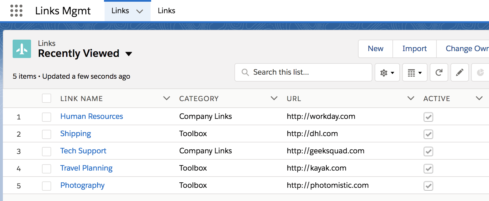
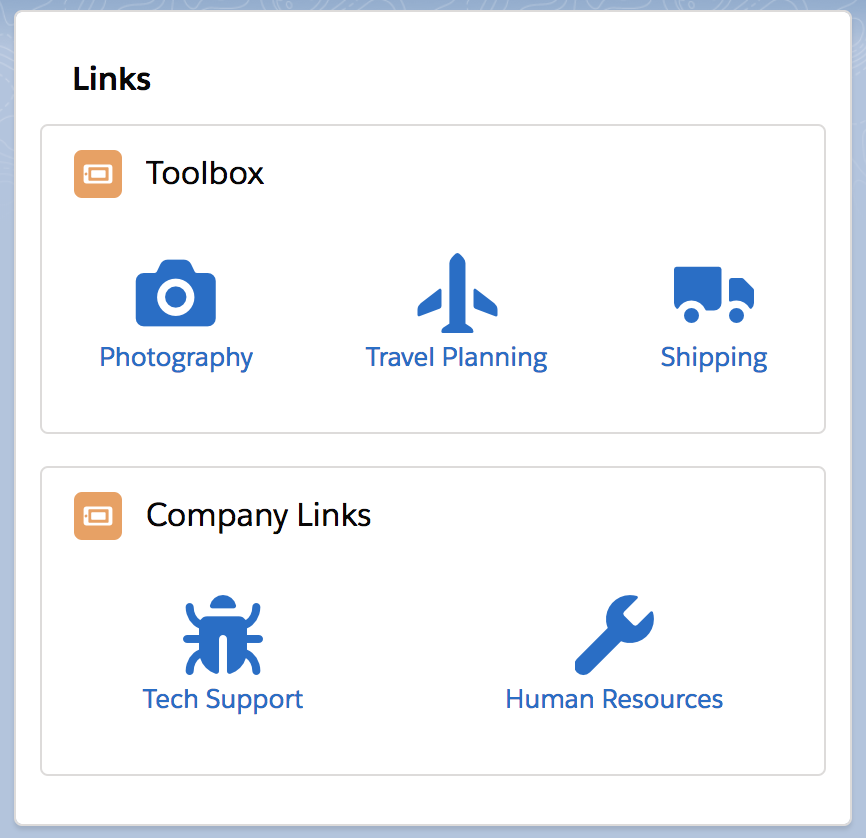

# Salesforce DX App

Salesforce app for managing links displayed on a Lightning component. 

Create records for the Link custom object. 

Place the LinkList Lightning component on a Lighting page or Community page. This component displays your links that are marked active and organized by the "Category". 

Each link is displayed with a Lightning Design System icon with the link name underneath and when clicked, will open the link in a new browser tab or window. Config parameters on the component let you change the title label, the icon displayed next to the category names, and limit the links displayed to a single category. 

